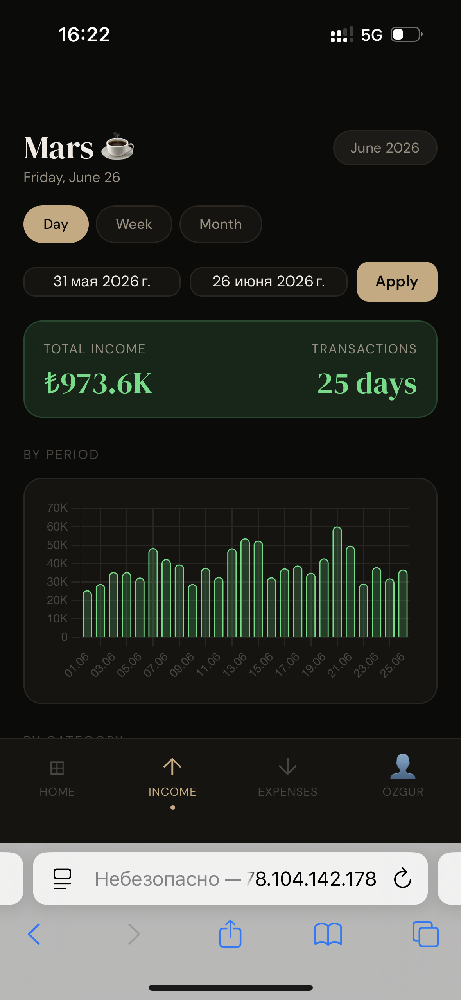
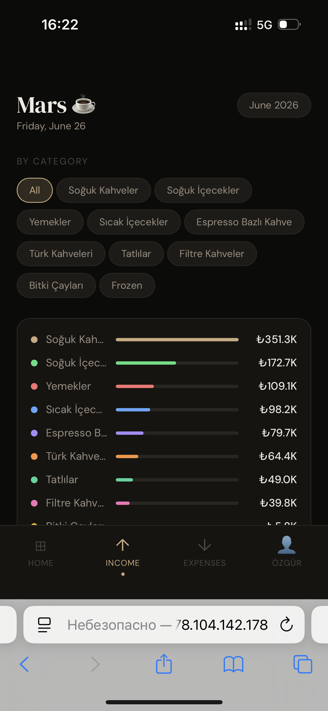
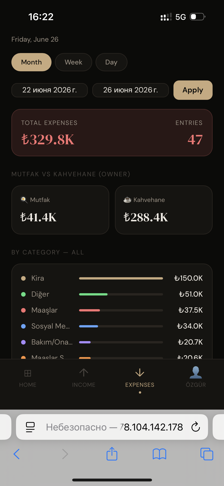

# 💰 Mars Money Bot

Expense tracking, sales sync, and tax estimation system for **Mars Coffee & Kitchen** café (Istanbul).  
Replaces spreadsheet-by-hand bookkeeping — staff and owner log expenses straight from Telegram, sales reports import themselves from email, and a live dashboard shows the numbers that matter.

---

## ✨ Features

- **Staff expense bot** — log Mutfak/Kahvehane purchases with category, payment method, and a receipt photo straight from Telegram
- **Owner expense bot** — separate bot for sensitive entries: salaries, rent, taxes, and personal-but-deductible expenses
- **Daily & monthly summaries** — `/gunozet` and `/ozet` break spending down by category, on demand
- **Automated sales import** — parses daily Kasa Raporu emails from Gmail (handles legacy `.xls` and Excel XML formats) straight into Google Sheets
- **Tax estimation engine** — a formula-driven sheet computes monthly KDV (VAT) and Peşin Vergi (advance tax) from sales and expenses, distinguishing official vs. unofficial spending
- **Live dashboard (PWA)** — password-protected mobile dashboard: income/expenses, daily averages (guests, orders, food, desserts), estimated tax, and the owner's personal spending breakdown
- **Google Sheets as the database** — every bot and the dashboard read/write the same spreadsheet, no separate backend to run

---

## 🛠 Tech Stack

| Layer | Tech |
|---|---|
| Bots | Python, [python-telegram-bot](https://github.com/python-telegram-bot/python-telegram-bot), APScheduler |
| Sales import | Gmail API, pandas, xlrd3 |
| Database | Google Sheets (via `gspread`) |
| Dashboard | HTML, CSS, Vanilla JS, Chart.js — installable PWA |
| Hosting | Hetzner VPS, nginx |
| Deploy | git push → bare repo → `post-receive` hook |

---

## 📂 Structure

```
staff_bot.py      Telegram bot — staff expense logging (Mutfak/Kahvehane)
owner_bot.py      Telegram bot — owner's expenses (Maaşlar, Kira, Kişisel, taxes)
gmail_parser.py   Pulls Kasa Raporu emails, parses XLS/XML, writes to Google Sheets
tax_setup.py      One-off setup: KDV rate table + monthly tax calculation sheet
web/              Dashboard PWA (index.html, config.js, manifest, service worker)
deploy/           post-receive hook for git-based deployment
```

---

## 📸 Screenshots

#### Telegram bot in action


#### Dashboard — Income



#### Dashboard — Expenses


---

## 🔐 Notes

- Secrets (`.env`, `credentials.json`, Gmail OAuth tokens) are git-ignored and never committed
- The dashboard's password and Google Sheets CSV links live in `web/config.js` — also git-ignored, set up once directly on the server
- Each expense category carries its own KDV rate and an "official vs. unofficial" flag, so tax estimates reflect what's actually declarable
